# chiron-cds-spike

> A SMART on FHIR + CDS Hooks application against the Oracle Health Code
> sandbox, written in .NET 9 / ASP.NET Core. Demonstrates the integration
> layer for a clinical reasoning engine that explains itself.

Advanced practice providers and physicians are drowning in alert fatigue — most CDS firing isn't actionable, and the alerts that *are* actionable get clicked past with the noise. This spike addresses the integration half of that problem (SMART launch, FHIR read/write, CDS Hooks delivery) and shows a reasoning engine that produces explainable cards every time: each card carries its complete derivation graph and a stable fingerprint that an override log can key off of.

## The demo

Three scenarios against the **real** Oracle Health Code sandbox. The patient data is genuine — patient id `12674028` (SMITH, ANNIE) is a real synthetic record published by Oracle for sandbox testing. No prefetch is hand-rolled.

### Scenario A — Real-data demo against the open sandbox

Run [`docs/sample-patient-view-request.json`](docs/sample-patient-view-request.json) through the CDS Hooks endpoint. The prefetch in that file was generated by curling Cerner's open sandbox for Annie Smith's actual Patient, Condition, and active MedicationRequest resources — every field is exactly what Cerner returns.

```bash
curl -s -X POST http://localhost:5099/cds-services/chiron-patient-view \
  -H 'Content-Type: application/json' \
  -d @docs/sample-patient-view-request.json | jq '.cards[] | {summary, indicator, uuid}'
```

Result (one card, on unmodified Cerner data):

> **CHA₂DS₂-VASc score 2: anticoagulation generally recommended.** *(warning)*

Click "Show derivation" → tree expands:

```
- rule: cha2ds2_vasc.high_risk
- cha2ds2_vasc.total = 2 points
  - female_sex = true        (real: Cerner returned gender=female)
  - diabetes = true          (real: active "Type 2 diabetes mellitus" condition)
- citation: AHA/ACC/HRS 2019 Focused Update
- fingerprint: 33cc0041c37010c5
```

This is a working integration end to end — Annie Smith's real chart from `fhir-open.cerner.com`, the FHIR-to-Fact mapper handling Cerner's wire shape (extensions, US Core profiles, multi-coding `clinicalStatus`), the engine deriving CHA₂DS₂-VASc from her female sex + diabetes condition, and the CDS Hooks card carrying the full Markdown derivation and a stable fingerprint.

The headline `metformin.renal.contraindicated` rule does **not** fire on Annie's real chart — she's 35 and her open-sandbox observations don't include a creatinine value. The metformin/renal scenario requires either (a) the **authenticated** Cerner FHIR endpoint (which exposes more of her chart than the public open endpoint), or (b) a different sandbox patient with both elevated creatinine and active metformin visible publicly — none such exists in the Code sandbox at the time of this commit. This is a real limitation of public sandbox data, not a limitation of the rule engine. The rule itself has unit-test coverage on multiple eGFR boundaries ([MetforminRenalTests](src/Chiron.Cds.Engine.Tests/MetforminRenalTests.cs)).

### Scenario B — The provenance moment

Each card's `uuid` is its alert fingerprint — a stable 16-character hash over `(rule_id, severity, sorted derivation fingerprints)`. Identical inputs produce identical fingerprints across runs and (by contract) across the Python and TypeScript implementations in [traceable-cds](#see-also). The fingerprint is the key the override log uses to detect alert fatigue.

Annie Smith's CHA₂DS₂-VASc fingerprint above (`33cc0041c37010c5`) is regenerated from her FHIR resources on every request; rerun the curl and you get the same value, because the inputs hash to the same canonical serialization.

### Scenario C — SMART launch + write-back

The SMART App Launch flow was driven manually against the real Cerner Code sandbox on 2026-05-21. End-to-end verified: dynamic well-known discovery, authorize URL with PKCE S256 + state + aud + launch token, CernerCare login at `authorization.cerner.com`, provider-sandbox patient picker, scope consent, code-for-token exchange via HTTP Basic confidential-client auth, token response with real patient + encounter + user context, session storage, redirect to `/app?session=…`, and bearer-authenticated FHIR call out to Cerner. Full evidence (real authorize URL, redacted token body, granted-scope list) is in [docs/REAL_LAUNCH_VERIFICATION.md](docs/REAL_LAUNCH_VERIFICATION.md).

The one remaining step that did **not** complete is the FHIR resource read on the authenticated endpoint: Cerner returned `HTTP 403 insufficient_scope` because the system account backing the SMART app registration is tagged `Production:Yes / Account Type:LIMITED`, and production-tier Cerner system accounts gate resource scope grants behind certification. The granted scope set contained the five SMART system scopes (`fhirUser launch online_access openid profile`) but none of the 19 requested resource scopes (`user/Patient.read`, etc.). A Cerner support request has been filed to provision a sandbox-tier system account — once that's granted, the `/app` page will render the alert card for Fredrick SMART (the elderly sandbox patient who fires CHA₂DS₂-VASc on age 75+ alone) and "Accept alert" will write a `DiagnosticReport` back to the authenticated endpoint.

The application code is verified correct; the blocker is a one-time Cerner-side account-tier provisioning step.

End the demo on the CDS Hooks discovery endpoint open in a browser tab — to show that the same engine output is available server-to-server to any EHR's CDS Hooks client, not just the SMART launch UI.

```bash
curl -s http://localhost:5099/cds-services | jq .
```

## What this gets right

- **Explainability by construction.** Every alert carries its full `Because` tree of Facts back to the input observations, and a citation list back to the source of truth (FDA labels, guideline papers). The card's CDS Hooks `detail` field renders the derivation as Markdown, so the EHR shows it inline.
- **Real Cerner FHIR data, not mocks.** [`RealCernerPatientTests`](tests/Chiron.Cds.Web.IntegrationTests/RealCernerPatientTests.cs) fetches a real Cerner sandbox patient's chart from `fhir-open.cerner.com` and pipes the unmodified resources through the CDS Hooks endpoint. No augmentation. No hand-rolled fixtures. The FHIR-to-Fact mapper handles Cerner's wire shape (extensions, US Core profiles, multi-coding `clinicalStatus`) as it actually is.
- **Dynamic SMART discovery.** Authorization and token endpoints are read from `/.well-known/smart-configuration` at runtime, per the SMART App Launch spec. Nothing about the OAuth endpoints is hardcoded — Cerner can rotate them and we keep working. The discovery half of the flow is verified against the real Cerner endpoint by [`SmartConfigurationTests`](tests/Chiron.Cds.Web.IntegrationTests/SmartConfigurationTests.cs); PKCE + state + confidential-client code-for-token exchange is implemented per SMART v2 but requires a manual browser launch to drive end to end.
- **Multi-tenant by construction.** Every FHIR call goes through a per-tenant client built from a per-tenant config in `TenantRegistry`. Cross-tenant access is impossible by construction; adding Epic / Athena / Meditech is a config change, not a code change.
- **Parity contract with the Python / TS engines.** The alert fingerprint algorithm is a canonical SHA-256 over `(rule_id, severity, sorted(parent fingerprints))`. The JSON fixtures in [`tests/Chiron.Cds.Engine.Tests/Fixtures/`](tests/Chiron.Cds.Engine.Tests/Fixtures) pin the canonical values that the Python and TS engines must match. See [`docs/PARITY.md`](docs/PARITY.md).

## Architecture

```mermaid
flowchart LR
  EHR[Cerner Code<br/>EHR + Authorize endpoint] -->|launch| Launch[/smart/launch/]
  Launch --> Authz[/Cerner authorize endpoint/]
  Authz --> Callback[/smart/callback/]
  Callback --> Token[/Cerner token endpoint/]
  Token --> App[/app?session=…/]
  App --> Fetcher[PatientChartFetcher]
  Fetcher --> Fhir[(Cerner FHIR)]
  Fhir --> Mapper[FhirToFactMapper]
  Mapper --> Engine[Reasoning Engine]
  Engine --> CardMapper[AlertToCdsCardMapper]
  CardMapper --> UI[CDS card UI]
  CardMapper -.-> CDS[CDS Hooks patient-view]
  App --> Writer[DiagnosticReportWriter]
  Writer --> Fhir
```



The reasoning engine ([`src/Chiron.Cds.Engine/`](src/Chiron.Cds.Engine)) is a pure-logic library with no external dependencies. The web layer ([`src/Chiron.Cds.Web/`](src/Chiron.Cds.Web)) wraps the engine with SMART launch, FHIR I/O via Firely, and CDS Hooks delivery.

## A single CDS Card, in full

What the EHR receives when [docs/sample-patient-view-request.json](docs/sample-patient-view-request.json) (real Annie Smith chart, unmodified Cerner data) is POSTed to `/cds-services/chiron-patient-view`:

```json
{
  "cards": [
    {
      "summary": "CHA₂DS₂-VASc score 2: anticoagulation generally recommended.",
      "indicator": "warning",
      "source": {
        "label": "Chiron Clinical Reasoning",
        "url": "https://chiron.health/cds/cha2ds2_vasc.high_risk"
      },
      "detail": "**Rule:** `cha2ds2_vasc.high_risk`\n**Severity:** Medium\n**Fingerprint:** `33cc0041c37010c5`\n\n### Derivation\n\n- **cha2ds2_vasc.total** = `2` points\n  - **diabetes** = `true`\n  - **female_sex** = `true`\n\n### Citations\n\n- AHA/ACC/HRS guideline, 2019 Focused Update; Circulation 2019;140:e125-e151 (accessed 2026-04-29) — [link](https://www.ahajournals.org/doi/10.1161/CIR.0000000000000665)\n",
      "uuid": "33cc0041c37010c5",
      "overrideReasons": [
        { "code": "bleeding_risk_outweighs_benefit", "system": "https://chiron.health/cds/override-reasons", "display": "Bleeding Risk Outweighs Benefit" },
        { "code": "patient_declined_anticoagulation", "system": "https://chiron.health/cds/override-reasons", "display": "Patient Declined Anticoagulation" },
        { "code": "active_bleeding", "system": "https://chiron.health/cds/override-reasons", "display": "Active Bleeding" }
      ]
    }
  ]
}
```

## Running it yourself

See [`docs/SETUP.md`](docs/SETUP.md) for full instructions. The short version:

```bash
# .NET 9 SDK required
dotnet user-secrets set "Chiron:Tenants:cerner-code-sandbox:ClientSecret" "<paste from code Console>" \
  --project src/Chiron.Cds.Web
dotnet run --project src/Chiron.Cds.Web
```

Then go to the Oracle Health Code Console, find the registered Chiron app, and click "Launch."

The CDS Hooks endpoints are reachable without authentication for the spike:

```bash
curl -s http://localhost:5099/cds-services | jq .
curl -s -X POST http://localhost:5099/cds-services/chiron-patient-view \
  -H 'Content-Type: application/json' \
  -d @docs/sample-patient-view-request.json | jq .
```

## Production gap

This is a spike, not a production deployment. The deliberate gaps are catalogued in [`docs/PRODUCTION_GAP.md`](docs/PRODUCTION_GAP.md). The top items:

- Token storage is in-memory; production needs Data Protection API + Redis.
- `ServiceRequest` write is unimplemented (the Cerner Code sandbox is read-only for that resource).
- `id_token` JWS signature is not yet validated against the JWKS — implementation hook exists but is wired off for the spike.
- Drug interaction list is hand-rolled; production would license First Databank / Lexicomp / Multum.
- No OpenTelemetry, no distributed tracing.
- CDS Hooks endpoint accepts unauthenticated POSTs; production relies on the EHR's mutual TLS.

## See also

- **traceable-cds** — Python + TypeScript implementations of the same engine.
- **HL7-provenance** — HL7 v2 ingest with the same provenance contract.

## Tests

```bash
dotnet test                              # everything
dotnet test --filter Category=Live       # only tests that hit the real Cerner sandbox
```

The integration tests boot the app via `WebApplicationFactory<Program>`. Tests tagged `Category=Live` reach out to the public Cerner endpoints — notably [`RealCernerPatientTests`](tests/Chiron.Cds.Web.IntegrationTests/RealCernerPatientTests.cs), which fetches Annie Smith's real chart from `fhir-open.cerner.com` and pipes the unmodified resources through the CDS Hooks endpoint, asserting that CHA₂DS₂-VASc fires on her actual data. There's a paired test that fetches Nancy Smarts's real chart and asserts no spurious alerts. Live tests degrade gracefully (no failure) on network errors so flaky CI doesn't block PRs on Cerner outages.
