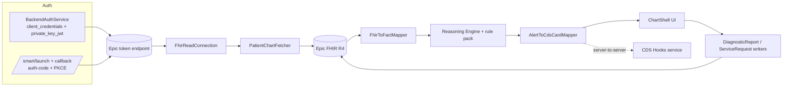

# CDS Spike

> A clinician-facing **SMART on FHIR + CDS Hooks** application in **.NET 9 / ASP.NET Core**, running live against the **Epic on FHIR** sandbox. It pulls real patient charts, renders them in an EHR-style workflow, and surfaces **explainable** clinical-decision-support cards — every card carries its full derivation graph back to the source data.

This is a spike that demonstrates the *integration layer* for a clinical reasoning engine: SMART authorization, FHIR read/write, a CDS Hooks service, and a clinician UI that puts decision support inside the chart workflow. The data is genuine Epic sandbox data — no mocks, no hand-rolled fixtures.

---

## What's built

### Connectivity — SMART on FHIR against Epic (live)
- **SMART Backend Services** (`client_credentials` + `private_key_jwt`, RS384) — the working path that powers the demo. The app signs a JWT assertion with a private key whose public half is published at a hosted **JWK Set URL**, exchanges it for a `system/*` access token, and reads real Epic FHIR data with no interactive login. ([`BackendAuthService`](src/Chiron.Cds.Web/SmartLaunch/BackendAuthService.cs))
- **SMART App Launch** (authorization-code + PKCE S256) with dynamic `/.well-known/smart-configuration` discovery, `id_token` JWS validation against the tenant JWKS, standalone-vs-EHR launch scope handling, and confidential-client token exchange. ([`AuthorizationService`](src/Chiron.Cds.Web/SmartLaunch/AuthorizationService.cs), [`IdTokenValidator`](src/Chiron.Cds.Web/SmartLaunch/IdTokenValidator.cs)) *(Interactive login is currently blocked by Epic-side sandbox account state — see [Status](#status--honest-gaps).)*
- **Multi-tenant by construction** — every FHIR call goes through a per-tenant client built from [`TenantRegistry`](src/Chiron.Cds.Web/Tenancy/TenantRegistry.cs). Adding an EHR is a config change. Two tenants ship: `epic-sandbox` (authenticated, via Backend Services) and `cerner-code-sandbox` (open/unauthenticated fallback).

### FHIR I/O (Firely `Hl7.Fhir.R4`)
- **Read**: Patient, Condition, Observation (labs + vitals), Encounter, MedicationRequest, AllergyIntolerance, Immunization, Procedure, DiagnosticReport — fetched in parallel and assembled into a `PatientChart`. ([`PatientChartFetcher`](src/Chiron.Cds.Web/FhirClient/PatientChartFetcher.cs))
- **Write**: DiagnosticReport and ServiceRequest writers. ([`DiagnosticReportWriter`](src/Chiron.Cds.Web/FhirClient/DiagnosticReportWriter.cs), [`ServiceRequestService`](src/Chiron.Cds.Web/Panel/ServiceRequestService.cs))
- **FHIR → engine facts** mapping that handles real EHR wire shapes — `medication[x]` choice types, `onset`/`recordedDate`, multi-coding `clinicalStatus`, BP component observations, configurable MRN identifier system. ([`FhirToFactMapper`](src/Chiron.Cds.Web/Mappers/FhirToFactMapper.cs))

### CDS Hooks service
A spec-compliant CDS Hooks service ([`CdsHooks/`](src/Chiron.Cds.Web/CdsHooks/)) with discovery (`GET /cds-services`) and four hooks:

| Hook | Service id |
|---|---|
| `patient-view` | `chiron-patient-view` |
| `order-select` | `chiron-order-select` |
| `order-sign` | `chiron-order-sign` |
| `medication-prescribe` | `chiron-medication-prescribe` |

Every card carries a Markdown **derivation graph** (inputs → guideline → recommendation), a stable **fingerprint** (a SHA-256 over `rule_id + severity + sorted parent fingerprints`, used to key an override log), and structured **override reasons**.

### Reasoning engine + rule pack
A pure-logic library with no external dependencies ([`src/Chiron.Cds.Engine/`](src/Chiron.Cds.Engine)). The rule pack is auto-registered from the assembly:

| Category | Rule | Fires when |
|---|---|---|
| Interactions | Drug–allergy collision | an active med matches a documented allergy (by substance or class) |
| Interactions | Warfarin + NSAID | both on the active med list (bleeding risk) |
| Interactions / Renal | Renal dose adjustment | a med's eGFR threshold is crossed (eGFR from creatinine + age + sex, CKD-EPI 2021) |
| Renal | Metformin contraindication | eGFR < 30 mL/min/1.73m² |
| Geriatric | Beers Criteria (2023 AGS) | potentially-inappropriate med in adults 65+ |
| Preventive | Immunization gaps | missing/overdue adult vaccines per ACIP |
| Scores | CHA₂DS₂-VASc | atrial-fibrillation stroke-risk score |
| Scores | ASCVD 10-yr risk | ACC/AHA Pooled Cohort; flags statin eligibility ≥ 7.5% |

### Clinician UI — an EHR-style workflow
All patient-chart routes render inside one shared [`ChartShell`](src/Chiron.Cds.Web/Panel/ChartShell.cs): a dark patient-identity top bar, a left icon rail with per-section nav, and a tab strip. Navigating tabs or taking actions only swaps the content region — the frame stays put.

- **Summary** ([`EhrChartRenderer`](src/Chiron.Cds.Web/Panel/EhrChartRenderer.cs)) — Problem List (dated, ordered), Medications, Allergies, Key Labs (most-recent value, expandable to full history), and the **Clinical Decision Support panel** where the engine's cards surface.
- **Labs & Results** — lab trends (sparkline + history) and recent diagnostic reports.
- **Orders** — medication and lab/imaging order entry; the engine runs on **Sign**, surfacing inline CDS cards (critical alerts require acknowledgment before writing).
- **Notes** — SOAP note entry + history. **Sign off** — encounter close.
- **Panel worklist** (`/app/panel`) and **multi-field search** (`/app/search`) — look up a patient by **MRN**, **name + date of birth**, or **encounter id** (matching Epic's Patient.Search parameter rules). ([`PatientSearchService`](src/Chiron.Cds.Web/Panel/PatientSearchService.cs))

---

## See it working

Run the app (see [Running locally](#running-locally)), then open a patient's chart:

```
https://localhost:5001/app/patient/erXuFYUfucBZaryVksYEcMg3
```

That's **Camila Lopez** (MRN `203713`), a real Epic sandbox patient. The page renders her live chart — 9 conditions, labs, vitals, her active medication — and the **Clinical Decision Support** panel shows a live card (an ACIP immunization-gap recommendation) with its derivation expanded. Click **Search** and enter MRN `203713`, or a name + DOB, to find any sandbox patient.

The same engine output is available server-to-server to any EHR's CDS Hooks client:

```bash
curl -s https://localhost:5001/cds-services | jq .
curl -s -X POST https://localhost:5001/cds-services/chiron-patient-view \
  -H 'Content-Type: application/json' \
  -d @docs/sample-patient-view-request.json | jq '.cards[] | {summary, indicator, uuid}'
```

---

## Architecture



**Projects**
- [`src/Chiron.Cds.Engine`](src/Chiron.Cds.Engine) — pure reasoning engine + rule pack (no FHIR/web deps).
- [`src/Chiron.Cds.Web`](src/Chiron.Cds.Web) — SMART auth, FHIR I/O, CDS Hooks, and the clinician UI.
- [`src/Chiron.Cds.Shared`](src/Chiron.Cds.Shared) — shared DTOs/exceptions.
- [`tests/`](tests) — engine unit tests + web integration tests.

Deeper design notes: [`docs/ARCHITECTURE.md`](docs/ARCHITECTURE.md). Fingerprint parity contract with sibling engines: [`docs/PARITY.md`](docs/PARITY.md).

---

## Running locally

**Prerequisites:** .NET 9 SDK.

**Secrets** (via user-secrets — never committed): the Epic Backend Services flow needs the signing key; the SMART App Launch flow needs the client secret.

```bash
# RSA private key whose public JWK is published at the Backend Services app's JWK Set URL
dotnet user-secrets set "Chiron:EpicBackendPrivateKeyPem" "<PEM>" --project src/Chiron.Cds.Web
# (optional) confidential-client secret for the interactive SMART launch
dotnet user-secrets set "Chiron:Tenants:epic-sandbox:ClientSecret" "<secret>" --project src/Chiron.Cds.Web
```

**Run** (the `https` profile binds `https://localhost:5001`):

```bash
dotnet run --launch-profile https --project src/Chiron.Cds.Web
```

**Key routes**
- `/app/panel` — worklist (root `/` redirects here)
- `/app/search` — multi-field patient search
- `/app/patient/{id}` — Visit Brief (Summary), plus `/results`, `/orders`, `/notes`, `/signoff`
- `/cds-services` — CDS Hooks discovery
- `/smart/launch?iss=…` — SMART App Launch entry
- `/smart/backend-session?patient={id}` — **dev-only**: mints a session from the Backend Services token and renders that patient's chart (404 outside Development)

Full setup: [`docs/SETUP.md`](docs/SETUP.md).

---

## Tests

```bash
dotnet test                          # everything (146 engine + 463 web integration)
dotnet test --filter Category=Live   # only tests that hit the live sandbox
```

Integration tests boot the app via `WebApplicationFactory<Program>`. Live tests reach the real sandbox and **skip gracefully** (no failure) on outages or a creds-less host, so CI doesn't go red on a sandbox hiccup.

---

## Status & honest gaps

This is a spike. What works today, and what's deliberately incomplete:

**Working**
- Backend Services → live Epic charts rendered in the EHR UI, with CDS firing at patient-view and order-time.
- Multi-field search (MRN / name+DOB / encounter), real MRN display, lab history, dated problem list.

**Epic-side (config, not code)**
- Granted resource searches: Patient, Condition, Observation, Encounter, MedicationRequest, Immunization, DiagnosticReport. **`AllergyIntolerance.Search` is still pending** — until it's granted, the drug-allergy rule is starved.
- The **interactive SMART login** is blocked on sandbox account state; the Backend Services path is used for the demo instead.
- **Writes** (DiagnosticReport / ServiceRequest) need write scopes / an interactive write session — the read-only backend token can't exercise them end-to-end yet.

**Scope of this spike**
- This demonstrates **CDS within a clinical workflow** — the engine evaluating real chart data and surfacing explainable cards in the chart and at order-time. The proprietary diagnostic-reasoning engine is out of scope here; the rule pack is guideline/safety CDS used to exercise the integration.
- UI follow-ups: inline vitals strip, lab **trend charts** on the Summary, and a recent-notes list (need the fact mapper widened for vitals/observation history).

Deliberate production gaps (token storage, telemetry, drug-knowledge licensing, etc.): [`docs/PRODUCTION_GAP.md`](docs/PRODUCTION_GAP.md).
